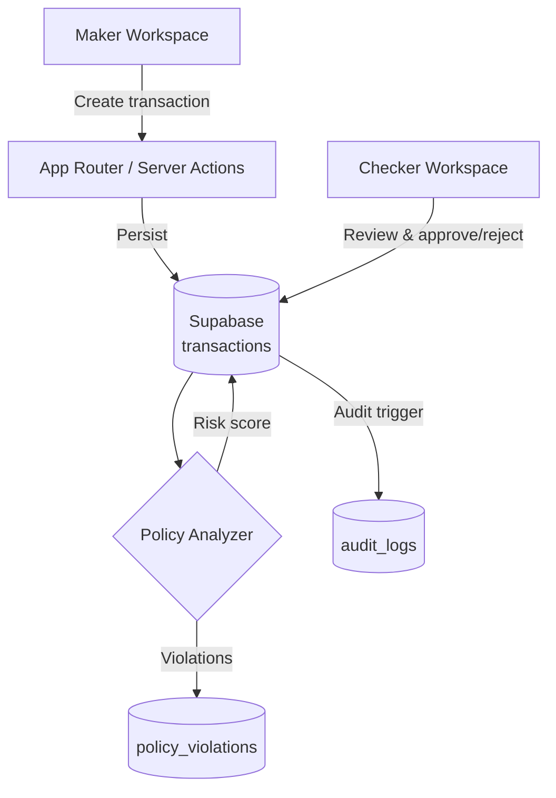
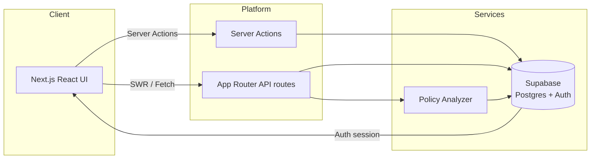

# SecureControl - Maker-Checker Banking Controls POC

SecureControl is a proof-of-concept banking controls platform that demonstrates a dual-authorization (maker-checker) workflow with automated policy analysis, blacklist management, and comprehensive audit trails. The application is built with Next.js App Router, Supabase for authentication and persistence, and a modular component library tailored for risk and compliance teams.

## Key Features
- Dual approval workflow with dedicated maker and checker workspaces
- Policy engine that scores transactions and persists violations for review
- Blacklist management with automatic transaction flagging
- Audit log explorer for transparent oversight of user activity
- Responsive, theme-aware UI built on Radix UI primitives and Tailwind CSS v4

## Tech Stack
- Next.js 16 (App Router) with React 19 and TypeScript
- Supabase (Postgres, Auth, Row Level Security)
- Tailwind CSS v4 with shadcn-inspired component system
- SWR data hooks and server actions for data access
- Vercel Analytics for lightweight usage insights

## Project Structure
```
app/                 # App Router routes, layouts, and API handlers
components/          # Reusable UI and dashboard modules
contexts/            # Shared React contexts (dashboard state)
hooks/               # Custom hooks for UI state and data fetching
lib/                 # Supabase client helpers, policy analyzer, utilities
scripts/             # SQL migrations and setup scripts for Supabase
styles/              # Global Tailwind layer overrides
```

## Getting Started
### Prerequisites
- Node.js 20+ and pnpm 9+ (recommended) or npm
- Supabase project with Auth enabled (email/password provider)

### Environment Variables
Create `.env.local` at the project root using the values from your Supabase project:
```
NEXT_PUBLIC_SUPABASE_URL=your-supabase-url
NEXT_PUBLIC_SUPABASE_ANON_KEY=your-anon-key
# Optional overrides
NEXT_PUBLIC_SITE_URL=http://localhost:3000
NEXT_PUBLIC_DEV_SUPABASE_REDIRECT_URL=http://localhost:3000/auth/callback
```

### Install and Run
```
pnpm install
pnpm dev
```
The development server runs on http://localhost:3000.

### Quality Checks
```
pnpm lint
pnpm build
```

## Database Setup
1. Create a new Supabase project and enable email authentication.
2. Apply the schema in `scripts/001_create_schema.sql` using the Supabase SQL editor or CLI to provision tables, RLS policies, triggers, and seed data.
3. (Optional) Adjust policy rule seeds or blacklist entries to match your testing scenarios.

## Core Workflows
### Maker-Checker Lifecycle


### High-Level Architecture


## Modules
- Dashboard contexts coordinate role-based navigation and layout state.
- `lib/policy-analyzer.ts` runs rule checks (amount thresholds, duplicates, blacklist, time-based) and persists flagged violations.
- App Router API route `app/api/transactions/analyze/route.ts` exposes risk scoring for newly created transactions.
- Tailwind component library under `components/ui/` wraps Radix primitives with project styling tokens.

## Future Scope
- Build a cheque ingestion pipeline with OCR-backed image/PDF processing, automated authenticity checks, and acceptance scoring rules
- Integrate workflow queues for multi-level approvals and SLA tracking
- Add automated notifications (email, Slack, Teams) on critical violations
- Extend analytics with risk trend dashboards and export capabilities
- Introduce maker/checker workload balancing based on domain expertise
- Harden RLS policies and introduce service-role functions for scheduled jobs

## System Design Roadmap
- Data plane: stage nightly ETL from core banking into warehouse targets (Snowflake, BigQuery) via Fivetran or Singer connectors, model settlement metrics with dbt, and stream CDC updates into Supabase for near real-time dashboards
- Compute: introduce background workers (BullMQ, Temporal, Supabase Edge Functions) for policy re-scoring, document OCR, ledger postings, and SLA-driven bulk approvals
- Scheduling: align Vercel Cron or Supabase Scheduled Functions with operational cutoffs for FX refresh, reconciliation, key rotation, and stale draft cleanup
- Eventing: publish transaction domain events to Kafka or Redpanda topics feeding AML screening, alerting, and downstream analytics pipelines
- Observability: wire Sentry, Datadog, and Grafana dashboards for latency, queue depth, risk rule drift, and policy breach alerts with automated escalation playbooks
- Reference the scalable architecture workbook in [docs/system-design.drawio](docs/system-design.drawio) for current vs planned topologies and flow diagrams

## Operations
- Environment promotion: mirror Supabase schema via SQL scripts or pg_dump
- Deployment: optimized for Vercel; configure environment variables per environment
- Monitoring: layer in Supabase logs and Vercel Analytics dashboards for observability

---
For questions or enhancements, open an issue or create a feature branch following standard GitHub flow.
